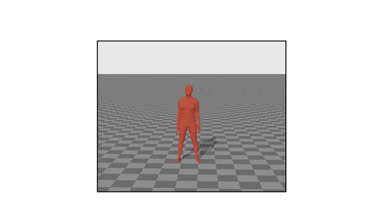

 

<p align="center">

  <h1 align="center">MotionFix: Text-Driven 3D Human Motion Editing
    <br>
    <a href='https://www.arxiv.org/abs/2408.00712'>
    
    </a>
    <a href='https://motionfix.is.tue.mpg.de/' style='padding-left: 0.5rem;'>
    
    </a>  
    <a href='https://motionfix.is.tue.mpg.de/explore.php' style='padding-left: 0.5rem;'>
    
    </a>
   </h1>
  <p align="center">
    <a href="https://ps.is.mpg.de/person/nathanasiou"><strong>Nikos Athanasiou</strong></a>
    |
    <a href="https://ps.is.mpg.de/person/acseke"><strong>Alpár Cseke</strong></a>
    |
    <a href="https://ps.is.mpg.de/person/mdiomataris"><strong>Markos Diomataris</strong></a>
    |
    <a href="https://ps.is.tuebingen.mpg.de/person/black"><strong>Michael J. Black</strong></a>
    |
    <a href="https://imagine.enpc.fr/~varolg"><strong>G&#252;l Varol</strong></a>
  </p>
  <h2 align="center">SIGGRAPH ASIA 2024, Tokyo, Japan</h2>
 <div align="center">
  
  </div>
 <div align="center">Official PyTorch implementation of the paper "MotionFix: Text-Driven 3D Human Motion Editing". This repository includes instructions for the released dataset and implementation of TMED, the model used in the paper along with the main experiments.</div>
</p>

<!-- | Paper Video                                                                                                | Qualitative Results                                                                                                |
|------------------------------------------------------------------------------------------------------------|--------------------------------------------------------------------------------------------------------------------|
| [](https://www.youtube.com/) | -->
## Updates 
 - [Oct. 30th '24] Release of a script to visualize motions (a demo will follow-up until December). For a quick workaround to visualize see [https://github.com/athn-nik/motionfix/issues/2](here).
 - [Sep. 20th '24] Release of the dataset and the exploration website.
 - [Aug. 30th '24] First release of the code.

## Getting MotionFix Dataset

You can try extracting the dataset from AMASS, given our annotations which can be downloaded from [here](https://drive.google.com/file/d/1Yk68qfDdn1kPCkhj27lv-J78Z-3KJ9L_/view?usp=sharing). 
Check and our explore our data in [our exploration webpage](https://motionfix.is.tue.mpg.de/explore.php).
First, check [our License](https://motionfix.is.tue.mpg.de/license.html).
Then, you can download our data already processed and ready to use from [this link](https://drive.google.com/drive/folders/1DM7oIJwxwoljVxAfhfktocTptwVX5sqR?usp=sharing).

<h2 align="center">Environment & Basic Setup</h2>

MotionFix has been implemented and tested on Ubuntu 20.04 with python >= 3.10.

Clone the repo:
```bash
git clone https://github.com/athn-nik/motionfix.git
```

After it do this to install DistillBERT:

```shell
cd deps/
git lfs install
git clone https://huggingface.co/openai/clip-vit-large-patch14
cd ..
```

Install the requirements using `virtualenv` :
```bash
# pip
source scripts/install.sh
```
You can do something equivalent with `conda` as well.

After that get the data and models needed.
```bash
# pip
source scripts/download_data.sh
```

<h2 align="center">Data & Training</h2>

## Evaluation of Model
To get a checkpoint of our model and run inference, you can download it 
from [this link](https://drive.google.com/drive/folders/1M_i_zUSlktdEKf-xBF9g6y7N-lfDtuPD?usp=sharing).
Then, you can use this checkpoint to extract samples and compute metrics as described below.

### Step 1: Extract the samples

```bash
python motionfix_evaluate.py folder=/path/to/exp/ guidance_scale_text_n_motion=2.0 guidance_scale_motion=2.0 data=motionfix
```
This will generate samples from the diffusion model for the MotionFix test set. By default the `/path/to/exp` should be `experiments/tmed`, but your path should be adjusted
according to where you have your experiments. The samples are generated in a path that looks like `3way_steps_300_motionfix_noise_last/ld_txt-2.0_ld_mot-2.0`. The first part indicateds
the parameters of sampling (number of steps, dataset name, initialization of diffusion, checkpoint which we sample from) and the second part the diffusion values for the two conditions.

### Step 2: Compute the metrics

```bash
python compute_metrics.py folder=/path/to/exp/samples/npys
```
That `/path/to/exp/samples/npys` should be something like  `experiments/tmed/3way_steps_300_motionfix_noise_last/ld_txt-2.0_ld_mot-2.0`, if you followed the previous step successfully.
Metrics will be printed in stdout.

<div align="center"><h3>Data Setup</h3></center></div>

Then create a directory named `data` and put the babel data and the processed amass data in.
You should end up with a data folder with the structure like this (`tree dirname`):

```
data
|---- motionfix
|     ├── motionfix.pth.tar 
|     ├── motionfix_val.pth.tar
|     ├── motionfix_test.pth.tar
|---- body_models
|     ├── smplh
|         ├──SMPLH_MALE.npz
|         ├──...
|     ├── smpl
|          ├──SMPLH_MALE.pkl
|          ├──...
eval-deps
|---- config.json
|---- last_weights
│     ├── motion_decoder.pt
│     ├── motion_encoder.pt
│     └── text_encoder.pt
├──-- logs
│     ├── checkpoints
│     │   ├── last.ckpt
│     ├── hparams.yaml
│     └── metrics.csv
└── stats
    └── humanml3d
        └── amass_feats
            ├── mean.pt
            └── std.pt
```

Be careful not to push any data! 
Then you should softlink inside this repo. To softlink your data, do:

`ln -s /path/to/data`

You can do the same for your experiments:

`ln -s /path/to/logs experiments`

This the best way to have a consistent structure and namings, while keeping the data stored 
in a different location, which does not interfere with the code (IMO).


<div align="center"><h3>Step 2: Training</h3></center></div>

To start training after activating your environment. Do:

```shell
python train.py experiment=... logger=... run_id=... exp_dir=...
```
- `logger=wandb` or none.
- `experiment` name of the experiment folder e.g., `ablation-data`.
- `run_id` subname of the experiment e.g., `10percent_data`
- `exp_dir` the folder where you want the experiments to be saved (defaults is `./experiments`).

Such a training will create a folder `exp_dir/experiment/run_id` where all the experiments logs are saved.

Explore `configs/train.yaml` to change some basic things like where you want
your output stored, which data you want to choose if you want to do a small
experiment on a subset of the data etc.
You can check the `train.yaml` for the main configuration
and this file will point you to the rest of the configs (eg. `model` refers to a config found in
the folder `configs/model` etc.).

## Citation

```bibtex
@inproceedings{athanasiou2024motionfix,
  title = {{MotionFix}: Text-Driven 3D Human Motion Editing},
  author = {Athanasiou, Nikos and Ceske, Alpar and Diomataris, Markos and Black, Michael J. and Varol, G{\"u}l},
  booktitle = {SIGGRAPH Asia 2024 Conference Papers},
  year = {2024}
}
```

## License
This code is available for **non-commercial scientific research purposes** as defined in the [LICENSE file](LICENSE). By downloading and using this code you agree to its terms. For MotionFix dataset check its [license](https://motionfix.is.tue.mpg.de/license.html). Third-party datasets and software are subject to their respective licenses.


## Contact

This code repository was implemented by [Nikos Athanasiou](https://is.mpg.de/~nathanasiou). It incorporates a version of [TMR](https://github.com/Mathux/TMR) for evaluation.

Give a ⭐ if you like it.
